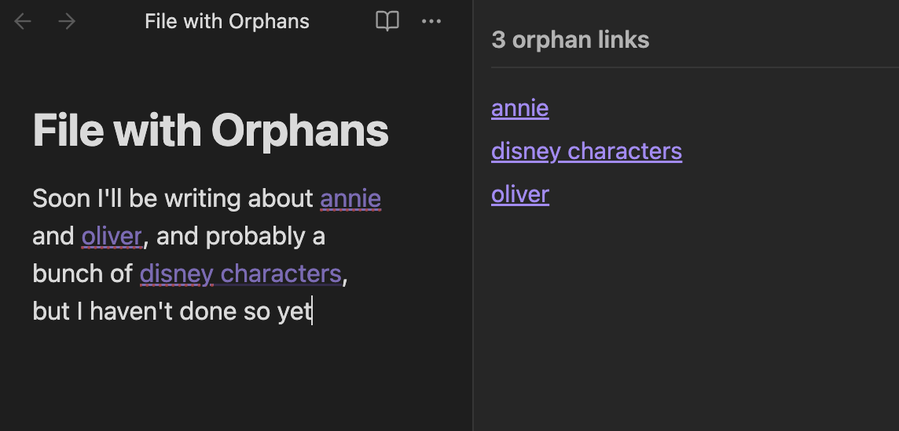

# Adopt Orphan

Obsidian plugin for quickly accessing unresolved/orphan links through a side panel

## How to Use

1. **Open the panel**: Click the broken link icon in the ribbon or use the command palette
2. **View orphans**: See all links that don't have corresponding files
3. **Create files**: Click any orphan to create an empty file and open it
4. **Keep writing**: The panel updates in real-time as you work

## Installation

### From Obsidian Community Plugins

1. Open Settings → Community Plugins
2. Search for "Adopt Orphan"
3. Install and enable the plugin

### Manual Installation

1. Download the latest release
2. Extract to your `.obsidian/plugins/adopt-orphan/` folder
3. Enable the plugin in Settings → Community Plugins

## For Developers

To build this plugin:

1. Clone this repo
2. Run `npm i` to install dependencies
3. Run `npm run build` to build the plugin
4. Copy the built files to your `.obsidian/plugins/adopt-orphan/` folder
